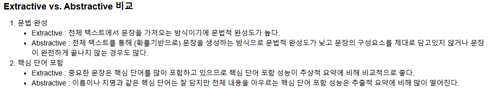

# AIFFEL Campus Online Code Peer Review Templete
- 코더 : 이창민
- 리뷰어 : 김영민


# PRT(Peer Review Template)
- [x]  **1. 주어진 문제를 해결하는 완성된 코드가 제출되었나요?**
    - 문제에서 요구하는 최종 결과물이 첨부되었는지 확인
        - 중요! 해당 조건을 만족하는 부분을 캡쳐해 근거로 첨부
        
        
        
        - 데이터 분석, 데이터 정제, 정규화와 불용어 처리, 결측치 제거, 데이터셋 분리, 인코딩 과정 등이 모두 빠짐없이 기록되어 있고 순서대로 체계적으로 진행되어 있습니다.
        - 모델 학습에 따른 train과 validation의 loss가 plot으로 보기좋게 구성되어 있습니다.
        - 요약문에 있는 핵심단어들이 요약문장안에 잘 포함되어 있습니다.
        - 두 요약 결과를 비교한 결과를 마크다운 문법을 통해 정리하였습니다.
    
- [x]  **2. 전체 코드에서 가장 핵심적이거나 가장 복잡하고 이해하기 어려운 부분에 작성된 
주석 또는 doc string을 보고 해당 코드가 잘 이해되었나요?**
    - 해당 코드 블럭을 왜 핵심적이라고 생각하는지 확인
    - 해당 코드 블럭에 doc string/annotation이 달려 있는지 확인
    - 해당 코드의 기능, 존재 이유, 작동 원리 등을 기술했는지 확인
    - 주석을 보고 코드 이해가 잘 되었는지 확인
        - 중요! 잘 작성되었다고 생각되는 부분을 캡쳐해 근거로 첨부
        
        - 코드의 순서에 맞게 꼼꼼하게 주석이 달려있고 개인적으로 이번 실습에서 가장 중요하다 생각한 요약문 비교하기가 체계적으로 가독성좋게 정리되어 있습니다.
        
- [x]  **3. 에러가 난 부분을 디버깅하여 문제를 해결한 기록을 남겼거나
새로운 시도 또는 추가 실험을 수행해봤나요?**
    - 문제 원인 및 해결 과정을 잘 기록하였는지 확인
    - 프로젝트 평가 기준에 더해 추가적으로 수행한 나만의 시도, 
    실험이 기록되어 있는지 확인
        - 중요! 잘 작성되었다고 생각되는 부분을 캡쳐해 근거로 첨부
        
        - summarize에서 문장이 짧고 ratio가 지나치게 작아서 요약이 되지 않는 현상을 발견하고 ratio를 적게주고 문장을 합쳐 summary를 생성하였습니다.
        
- [x]  **4. 회고를 잘 작성했나요?**
    - 주어진 문제를 해결하는 완성된 코드 내지 프로젝트 결과물에 대해
    배운점과 아쉬운점, 느낀점 등이 기록되어 있는지 확인
    - 전체 코드 실행 플로우를 그래프로 그려서 이해를 돕고 있는지 확인
        - 중요! 잘 작성되었다고 생각되는 부분을 캡쳐해 근거로 첨부
        
        - 학습을 진행하며 궁금한 점, 더 공부해볼 부분을 잘 정리하여 회고로 작성했습니다.
        
- [x]  **5. 코드가 간결하고 효율적인가요?**
    - 파이썬 스타일 가이드 (PEP8) 를 준수하였는지 확인
    - 코드 중복을 최소화하고 범용적으로 사용할 수 있도록 함수화/모듈화했는지 확인
        - 중요! 잘 작성되었다고 생각되는 부분을 캡쳐해 근거로 첨부
        
        - summa를 사용할 때 문장이 하나만 있고 ratio가 너무 낮아 요약이 되지않는 부분을 수정할 때 꼼꼼한 주석과 효율적인 코드로 summaize가 정상적으로 작동하도록 코드를 작성했습니다.
```python
# data['text']에 있는 데이터 중 일부를 가져옴
text = data['text'][0:10]
print(text)
# 각 문서에 대해 요약하기 (:ratio)
for i in range(len(text)):
    print(f"Summary of document {i+1}:")
    
    # 각 텍스트에 대해 summarize 호출
    summary = summarize(text.iloc[i], ratio=0.5, split=True)  # ratio 값을 조정해서 요약 비율 설정
    
    if summary:
        print(summary)  # 요약된 텍스트 출력
    else:
        print("No summary generated.")  # 요약이 생성되지 않은 경우
    print("\n" + "-"*50 + "\n")
# 각 문서에 대해 요약하기 (:words)
for i in range(len(text)):
    print(f"Summary of document {i+1}:\n")
    print(text.iloc[i])
    
    # 각 텍스트에 대해 summarize 호출
    summary = summarize(text.iloc[i], words=20, split=True)  # ratio 값을 조정해서 요약 비율 설정
    
    if summary:
        print(summary)  # 요약된 텍스트 출력
    else:
        print("No summary generated.")  # 요약이 생성되지 않은 경우
    print("\n\n" + "-"*50 + "\n")
```


# 회고(참고 링크 및 코드 개선)
```
# 리뷰어의 회고를 작성합니다.
# 코드 리뷰 시 참고한 링크가 있다면 링크와 간략한 설명을 첨부합니다.
# 코드 리뷰를 통해 개선한 코드가 있다면 코드와 간략한 설명을 첨부합니다.
```
- summaize를 문장을 합쳐서 활용하는 방법의 실제 코드를 보게 되서 참고해서 제 코드에 반영해 보도록 하겠습니다.
- 추상적 요약과 추출적 요약의 비교에서는 저와 거의 같은 의견을 보이고 있었습니다.
- 회고를 통해 궁금한 점을 적어 주셨는데 읽는 과정에서 저도 마찬가지로 궁금했습니다.
    - max_len을 선택할 때의 기준에 대해 지표를 궁금해 하셨는데 개인적으로 생각하기로는 통계학의 이론을 적용하면 좋을것 같습니다. 신뢰도와 신뢰비율을 고려하여 결정할 사안인것 같습니다.
